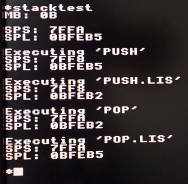

# stacktest

This is a demontration of the two separate stack pointers in the eZ80.

The original Z80 has one 16-bit stack pointer SP. The eZ80 has two stack pointers, a 24-bit stack pointer (SPL) and and a 16-bit stack pointer (SPS). When the CPU is running in ADL (24-bit) mode, PUSH and POP instructions will use the SPL. When the CPU is running in Z80 (16-bit) mode, PUSH/POP instructions will use the SPS, alhough the SPL can be accessed via the PUSH.L/POP.L instructions.

In other words, a program running in Z80 (16-bit) mode has its own local stack pointer, usually topping at $FFFF within its 16-bit address space. 

The stacktest program demonstrates this behaviour. It runs as a MOS command in Z80 (16-bit) mode.

- First value is pushed to the SPS using the PUSH instruction, the SPS decrements as a result, the SPL remains unaffected. 
- Then, a value is pushed to the SPL using the PUSH.L instruction, the SPL decrements, the SPS remains unaffected.
- Then the value from the SPS is recalled using the POP instruction, the SPS increments, the SPL remains unaffected. 
- Finally, the value from the SPL is recalled using the POP.L instruction, the SPL increments, the SPS remains unaffected. 

